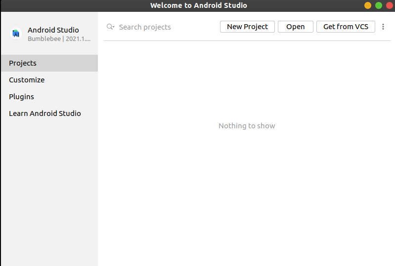

# App Description

This repository contains the modified versions of the [Emotion-on-the-go app](https://github.com/TKosch/emotions-on-the-go) by [Tkosch](https://github.com/TKosch) which is based on the paper "Emotions on the Go: Mobile Emotion Assessment in Real-Time using Facial Expressions".

DOI: https://doi.org/10.1145/3399715.3399928


<!-- // info of different branches: -->
There are 3 different branches, each containing a slight variation of the app.
<!--  Multi-options selection of user emotions, Single select, app usage data -->
1) [release/multi-option-select](https://github.com/ritiktaneja/emotions-on-the-go/tree/release/multi-option-select) branch contains the implementation of the app which provides multiple options for the actual(ground-truth) emotions of the user.
    

2) [release/single-option-select](https://github.com/ritiktaneja/emotions-on-the-go/tree/release/single-option-select) branch contains the implementation of the app which provides single options for the actual emotion of the user. 
    

3) [single-option-and-app-usage-collection](https://github.com/ritiktaneja/emotions-on-the-go/tree/release/single-option-and-app-usage-collection) contatins an upgraded version of the single-option-select app in which the app usage data of the user is also sent to the database. 

The app requires at least Android 5.0 (Lollipop).

## Installation
<!-- installing android studio -->
### For installing android studio follow this guide: https://developer.android.com/studio/install

### Clone the repository
```
    git clone https://github.com/ritiktaneja/emotions-on-the-go.git
```
### Open the project in Android studio
- Wait for the gradle scripts to execute.
<!-- // wait for gradle build -->

<!-- // Steps to create a new database: -->
## Connect a Firebase database
Follow this guide to connect the firebase database with your app: https://firebase.google.com/docs/android/setup

<!-- // update the database -->

<!-- // Building an apk -->
## Building the apk
Steps to build an apk in android studio: Build menu -> Build Bundle(s)/APK(s) -> Build APK(s) 


<!-- // FER analytics -->
## Directions to use the app
- Install the app and give permissions for the camera usage.
- Press the Start/Continue study to begin the data collection for 10 seconds.
- To manually stop the data collection, press Stop Study button.
- After collecting the data, click on the 'Rate current emotions' notification to input the actual user emotions.
- In case of App usage collection version of the app, give Usage Access permissions to the app.

<div>


</div>
<!--  -->
<!--  -->
<!--  -->

## Citing the App and the Paper

Below are the BibTex entries to cite the app and the paper

```
@misc{kosch:emotions,
  author = {Kosch, Thomas and Hassib, Mariam  and Reutter, Robin and Alt, Florian},
  title = {Emotions on the Go: Mobile Emotion Assessment in Real-Time using Facial Expressions},
  year = {2020},
  publisher = {GitHub},
  journal = {GitHub repository},
  howpublished = {\url{https://github.com/TKosch/emotions-on-the-go}}
}
```

```
@inproceedings{kosch2020emotions,
    author = {Kosch, Thomas and Hassib, Mariam and Reutter, Robin and Alt, Florian},
    title = {Emotions on the Go: Mobile Emotion Assessment in Real-Time using Facial Expressions},
    booktitle = {Proceedings of the 2020 International Working Conference on Advanced Visual Interfaces},
    series = {AVI '20},
    year = {2020},
    isbn = {978-1-4503-7535-1/20/09},
    location = {Salerno, Italy},
    numpages = {9},
    doi = {10.1145/3399715.3399928},
    publisher = {ACM},
    address = {New York, NY, USA}
} 
```
